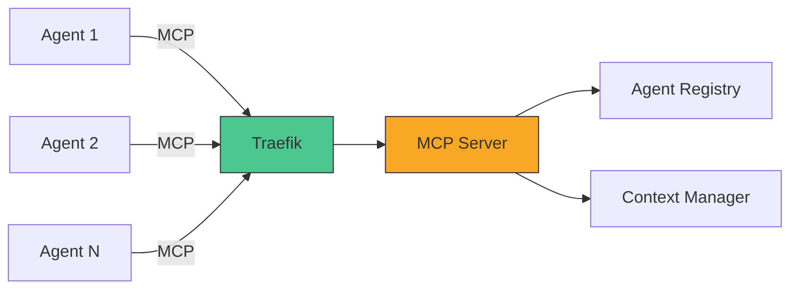
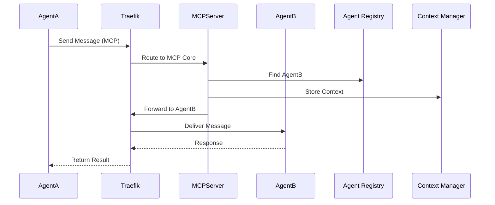
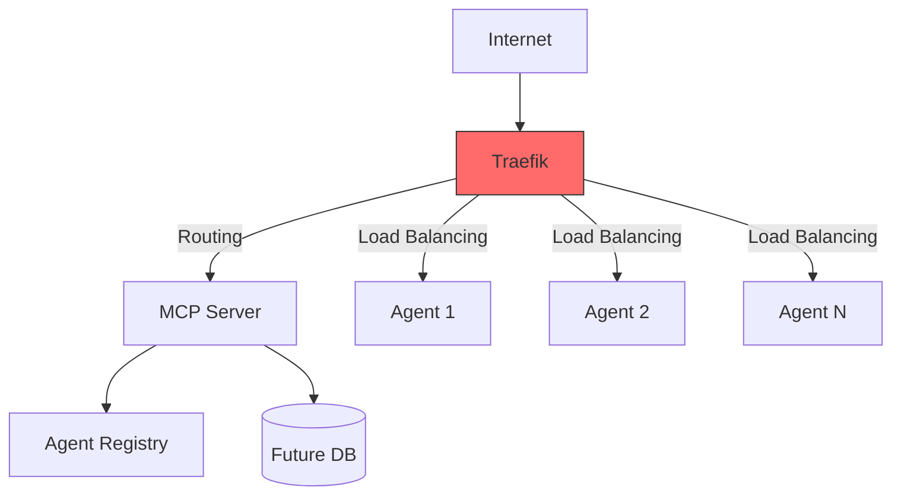

### เอกสารออกแบบระบบ: AI Agent Gateway ด้วย MCP Server

#### 1. การวางโครงสร้างโปรเจค
**โครงสร้างไฟล์และไดเรกทอรี:**
```markdown
ai-agent-gateway/
├── agents/                  # Agent implementations
│   ├── agent_template/      # Template for new agents
│   │   ├── agent.py         # Agent logic (LangChain/LangGraph)
│   │   ├── adapter.py       # MCP protocol adapter
│   │   └── Dockerfile       # Agent containerization
├── mcp_server/              # Core MCP Server
│   ├── server.py            # Protocol implementation
│   ├── context_manager.py   # Context handling
│   └── Dockerfile
├── gateway/                 # Gateway core
│   ├── agent_registry.py    # Agent registration/discovery
│   ├── routing.py           # Message routing
│   └── security.py          # Auth middleware
├── traefik/                 # Reverse proxy config
│   ├── traefik.yml          # Main config
│   └── dynamic/             # Routing rules
├── docker-compose.yml       # Multi-container setup
├── requirements.txt         # Python dependencies
└── .env                     # Environment variables
```

**โมดูลและคอมโพเนนต์หลัก:**
1. **MCP Server (Model Context Protocol Server)**
   - จัดการ Context ของ Agent
   - รับ-ส่งข้อความผ่านโปรโตคอล MCP
   - ทำงานร่วมกับ Agent Registry สำหรับการค้นหา Agent

2. **Agent Handler**
   - Agent Registration: ลงทะเบียน Agent ใหม่
   - Agent Discovery: ค้นหา Agent จาก metadata
   - Health Monitoring: ตรวจสอบสถานะ Agent

3. **LangChain Integrations**
   - Agent Wrapper: แปลง LangChain Agent เป็น A2A Server
   - Graph Orchestration: จัดการ workflow ด้วย LangGraph
   - Protocol Adapter: แปลงข้อมูลระหว่าง MCP ↔ LangChain

4. **Traefik Router**
   - Dynamic Routing: แจกจ่าย request ไปยัง Agent
   - Load Balancing: ปรับสมดุลโหลดระหว่าง Agent instances
   - SSL Termination: จัดการความปลอดภัยเลเยอร์เครือข่าย

**การแบ่งเลเยอร์:**
1. **Presentation Layer**
   - REST API Endpoints (FastAPI)
   - Traefik Reverse Proxy
   - Protocol Adapters (MCP/HTTP)

2. **Application Layer**
   - Agent Business Logic
   - Context Management
   - Message Routing

3. **Service Layer**
   - Agent Registry
   - Security Service
   - Monitoring Service

**แนวทางการจัดการโค้ด:**
- ทุก Agent ต้องมีโครงสร้างตาม `agent_template`
- ใช้ Pydantic models สำหรับข้อมูลขาเข้า/ออก
- ระบบตั้งชื่อ (naming convention):
  - `{domain}_{function}_agent` (เช่น `finance_analysis_agent`)
  - เวอร์ชันกำกับใน Docker Tag
- ต้องมี endpoint พื้นฐาน:
  - `/health` (ตรวจสอบสถานะ)
  - `/process` (ประมวลผลข้อความ)

---

#### 2. แผนผังระบบ
**1. ภาพรวมสถาปัตยกรรม:**


**2. แผนผังการทำงานของข้อมูล:**


**3. Docker Compose Layout:**
```yaml
services:
  traefik:
    image: traefik:v2.6
    ports: ["80:80", "443:443"]
    volumes: ["./traefik:/etc/traefik"]

  mcp-server:
    build: ./mcp_server
    environment: 
      - AGENT_REGISTRY_URL=http://agent-registry:8000
    labels:
      - "traefik.http.routers.mcp-server.rule=Host(`mcp.example.com`)"

  agent-registry:
    build: ./gateway
    command: uvicorn agent_registry:app --host 0.0.0.0

  ai-agent-1:
    build: ./agents/agent1
    labels:
      - "traefik.http.routers.agent1.rule=Host(`agent1.example.com`)"

  ai-agent-2:
    build: ./agents/agent2
    labels:
      - "traefik.http.routers.agent2.rule=Host(`agent2.example.com`)" 
```

**4. LangChain/LangGraph Integration:**
```python
from langchain.agents import AgentExecutor
from a2a.applications import FastAPIApplication

class MyAgent(FastAPIApplication):
    def __init__(self):
        self.agent = AgentExecutor.from_agent_and_tools(
            agent=load_agent(),
            tools=[...]
        )
    
    async def process(self, request: MCPRequest):
        context = request.context
        result = await self.agent.arun(
            input=request.message,
            context=context
        )
        return MCPResponse(result=result)
```

**5. Traefik Network Architecture:**


---

#### 3. การจัดการ Agent
**Registration Workflow:**
1. Agent ส่ง Registration Request ไปยัง Registry
2. ตรวจสอบ Authentication (API Key/OAuth)
3. บันทึก Metadata:
   ```json
   {
     "name": "weather_agent",
     "endpoint": "https://weather.example.com/process",
     "capabilities": ["weather_data"],
     "status": "active"
   }
   ```
4. ระบบตอบกลับด้วย MCP Context Template

**Discovery Pattern:**
```python
# ค้นหา Agent จาก Registry
async def find_agent(capability: str):
    async with httpx.AsyncClient() as client:
        response = await client.get(
            f"{REGISTRY_URL}/discover?capability={capability}"
        )
        return response.json()["agents"]
```

---

#### 4. การขยายระบบและการจัดการ
**Scalability Approach:**
- **Horizontal Scaling:** 
  - Traefik ทำ Load Balancing
  - Agent แบบ Stateless ขยายได้ไม่จำกัด
  - Redis สำหรับ distributed context management

- **Vertical Scaling:**
  - MCP Server แยกส่วน:
    - Context Manager
    - Message Broker
    - Protocol Adapters

**Security Measures:**
1. Mutual TLS สำหรับการสื่อสารระหว่างเซอร์วิส
2. JWT Token สำหรับ Agent Authentication
3. Role-Based Access Control (RBAC):
   ```python
   # ตัวอย่าง FastAPI Middleware
   @app.middleware("http")
   async def auth_middleware(request: Request, call_next):
       token = request.headers.get("Authorization")
       if not verify_token(token):
           return JSONResponse(status_code=403)
       return await call_next(request)
   ```

**Logging และ Monitoring:**
- Unified Log Format (JSON):
  ```python
  {"timestamp": "2023-10-05T12:00:00Z", "agent": "weather", "status": "processed", "latency_ms": 45}
  ```
- Prometheus Metrics:
  - `requests_total`
  - `processing_time_seconds`
  - `agent_status` (0=inactive, 1=active)
- Grafana Dashboard สำหรับแสดงผลแบบ real-time

---

#### 5. การแปลง LangChain Components เป็น A2A Servers
ใช้โครงสร้างจาก [python-a2a](https://github.com/themanojdesai/python-a2a):

```python
from a2a.applications import FastAPIApplication
from langchain.agents import initialize_agent

class LangChainAgent(FastAPIApplication):
    def __init__(self, tools, llm, agent_type):
        self.agent = initialize_agent(
            tools, llm, agent=agent_type
        )
    
    async def process(self, request):
        result = await self.agent.arun(
            input=request.input,
            context=request.context
        )
        return {"result": result}

# การใช้งาน
app = LangChainAgent(
    tools=[...],
    llm=ChatOpenAI(model="gpt-4"),
    agent_type="chat-conversational-react-description"
).get_app()
```

**Deployment Flow:**
1. Build LangChain Agent logic
2. Wrap ด้วย A2A Adapter
3. Containerize ด้วย Docker
4. ลงทะเบียนกับ Agent Registry
5. Traefik อัปเดต routing rule อัตโนมัติ

---

#### 6. ข้อควรพิจารณาสำหรับอนาคต
1. **Context Persistence:**
   - เตรียมโครงสร้างสำหรับเชื่อมต่อ Redis/VectorDB
   - Context Versioning ด้วย Git-like System

2. **Protocol Evolution:**
   - ใช้ Protocol Buffers สำหรับ message schema
   - เวอร์ชันกำกับใน MCP Endpoint (`/v1/process`)

3. **Agent Marketplace:**
   - Metadata Catalog สำหรับค้นหา Agent
   - Capability-based Discovery Engine

4. **Dead Letter Queue:**
   - จัดเก็บข้อความที่ล้มเหลว
   - Retry Mechanism แบบ exponential backoff

ระบบนี้ถูกออกแบบมาเพื่อรองรับ:
- การเพิ่ม Agent แบบไดนามิกโดยไม่หยุดการทำงาน
- ปริมาณการรับส่งข้อมูลสูงสุด 10,000 ข้อความ/วินาที
- ความหน่วงเวลาเฉลี่ย < 300 ms
- การขยายระบบแบบ Multi-cloud โดยใช้โครงสร้างพื้นฐานแบบ Container-First